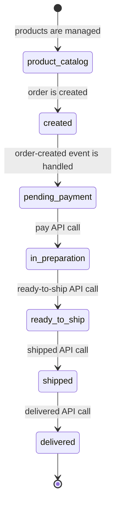
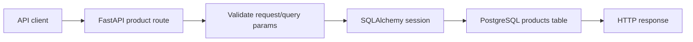
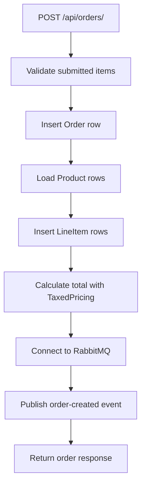
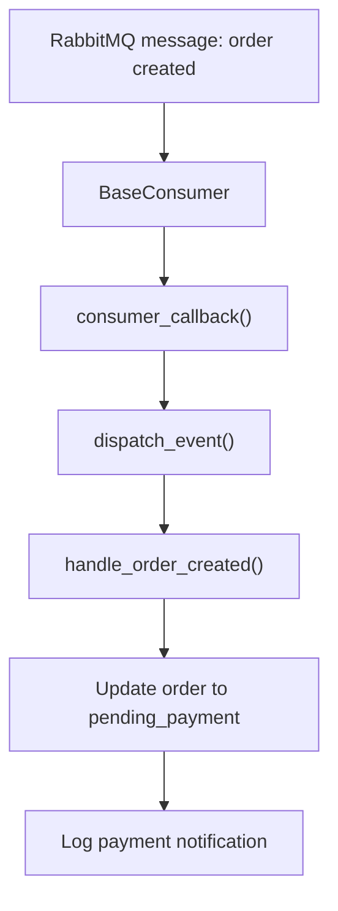
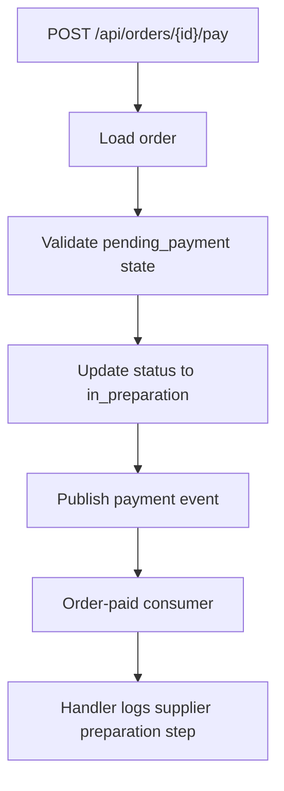
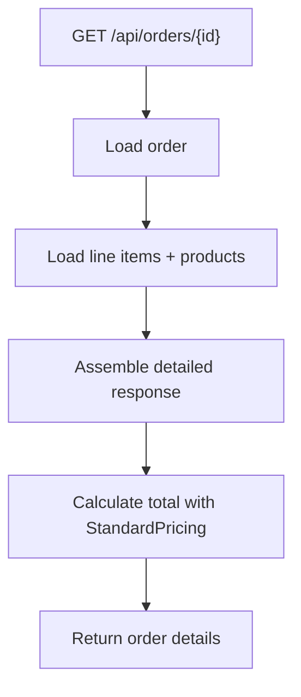
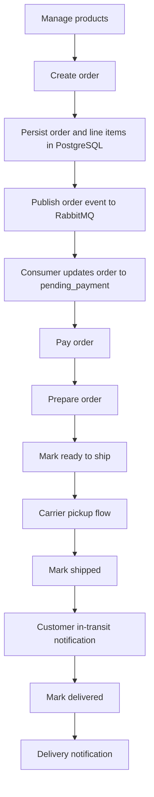

# Real-Time Order Processing System

This project is an order-processing API for a simple commerce workflow. A client can manage products, create orders, and move an order through payment, preparation, shipping, and delivery. Behind those API calls, the service persists state in PostgreSQL and publishes lifecycle events through RabbitMQ so background consumers can react to each stage.

The most useful way to read this codebase is from the business flow outward: what a user can do with the API, how the order state changes, and which infrastructure calls happen at each step.

## Business Flow

The system supports two user-facing capabilities:

1. product catalog management
2. order lifecycle management

### What API users can do

API consumers can:

- create a product
- list products with pagination, filtering, and sorting
- fetch a product by ID
- update a product
- delete a product
- create an order with one or more products
- fetch an order with item-level detail and totals
- mark an order as paid
- mark an order as ready to ship
- mark an order as shipped
- mark an order as delivered
- check service health

### Business lifecycle

At a business level, the order flow is:

1. an operator or client maintains a catalog of products
2. a customer order is created from those products
3. the system asks for payment
4. the order is marked as paid and moves into preparation
5. the prepared order is marked ready for shipment
6. the shipment is marked as sent
7. the shipment is marked as delivered

## Business Flows in Detail

Each section below starts from the business action, then traces the code path and infrastructure calls that make it happen.

### 1. Manage the Product Catalog

This is the setup flow for the rest of the system. Orders depend on products already existing in the catalog.

Supported endpoints:

- `GET /api/products/`
- `GET /api/products/{product_id}`
- `POST /api/products/`
- `PUT /api/products/{product_id}`
- `DELETE /api/products/{product_id}`

Primary code:

- [app/routers/products.py](/Users/monibaba/Documents/Workspace/Python/rtops/app/routers/products.py:17)
- [app/models/product_model.py](/Users/monibaba/Documents/Workspace/Python/rtops/app/models/product_model.py:1)
- [app/models/database.py](/Users/monibaba/Documents/Workspace/Python/rtops/app/models/database.py:1)

Business behavior:

- Product creation adds items that can later be ordered.
- Product listing lets clients browse inventory with filters and pagination.
- Product updates change sellable catalog data such as name, description, price, and stock.
- Product deletion removes products, subject to application constraints.

Infrastructure calls:

1. FastAPI receives the HTTP request through the router in [app/main.py](/Users/monibaba/Documents/Workspace/Python/rtops/app/main.py:5).
2. The route opens a SQLAlchemy session through `get_db()`.
3. SQLAlchemy reads or writes the `products` table in PostgreSQL.
4. The route returns the resulting payload directly. No RabbitMQ messaging is involved in this flow.

### 2. Create an Order

This is the first order-specific business action. A client submits one or more requested products and quantities, and the service creates the order record plus its line items.

Supported endpoint:

- `POST /api/orders/`

Primary code:

- [app/routers/orders.py](/Users/monibaba/Documents/Workspace/Python/rtops/app/routers/orders.py:25)
- [app/models/order_model.py](/Users/monibaba/Documents/Workspace/Python/rtops/app/models/order_model.py:1)
- [app/models/line_item_model.py](/Users/monibaba/Documents/Workspace/Python/rtops/app/models/line_item_model.py:1)
- [app/services/pricing.py](/Users/monibaba/Documents/Workspace/Python/rtops/app/services/pricing.py:1)
- [app/events/publisher.py](/Users/monibaba/Documents/Workspace/Python/rtops/app/events/publisher.py:1)

Business behavior:

1. the client submits order items
2. the service verifies that items were provided
3. the service verifies that each referenced product exists
4. the service creates the order and its line items
5. the service calculates the total price using `TaxedPricing`
6. the service publishes an order-created event
7. the API responds with the order ID, total, and current status

Infrastructure calls:

1. FastAPI receives `POST /api/orders/`.
2. The route opens a PostgreSQL session through SQLAlchemy.
3. SQLAlchemy inserts into `orders`.
4. SQLAlchemy loads matching `products`.
5. SQLAlchemy inserts related `line_items`.
6. The route calculates the total in process memory through the pricing strategy.
7. `EventPublisher` opens a RabbitMQ connection if needed.
8. The publisher declares the `order_exchange` direct exchange.
9. The publisher sends a persistent message to RabbitMQ.
10. The API returns the response to the caller.

### 3. Move a New Order into Payment Pending

This step is business-visible even though it happens asynchronously. After order creation, a consumer handles the order-created event and updates the order so the system is explicitly waiting for payment.

Primary code:

- [app/events/order_created_consumer.py](/Users/monibaba/Documents/Workspace/Python/rtops/app/events/order_created_consumer.py:1)
- [app/events/base_consumer.py](/Users/monibaba/Documents/Workspace/Python/rtops/app/events/base_consumer.py:1)
- [app/events/dispatcher.py](/Users/monibaba/Documents/Workspace/Python/rtops/app/events/dispatcher.py:1)
- [app/events/handlers.py](/Users/monibaba/Documents/Workspace/Python/rtops/app/events/handlers.py:9)

Business behavior:

1. the order-created message is consumed
2. the order is updated to `pending_payment`
3. the system logs a simulated user notification asking for payment

Infrastructure calls:

1. A RabbitMQ consumer process binds a queue to the exchange using routing key `order.created`.
2. RabbitMQ delivers the message to the consumer.
3. `consumer_callback()` deserializes JSON.
4. `dispatch_event()` selects a handler by event name.
5. The handler opens its own SQLAlchemy session.
6. PostgreSQL updates the `orders` row.
7. The consumer acknowledges the message.

### 4. Mark an Order as Paid

This is the business action that confirms payment and starts internal preparation.

Supported endpoint:

- `POST /api/orders/{order_id}/pay`

Primary code:

- [app/routers/orders.py](/Users/monibaba/Documents/Workspace/Python/rtops/app/routers/orders.py:165)
- [app/events/order_paid_consumer.py](/Users/monibaba/Documents/Workspace/Python/rtops/app/events/order_paid_consumer.py:1)
- [app/events/handlers.py](/Users/monibaba/Documents/Workspace/Python/rtops/app/events/handlers.py:26)

Business behavior:

1. the client requests payment completion for an order
2. the API verifies that the order exists
3. the API verifies that the order is in `pending_payment`
4. the API updates the order to `in_preparation`
5. the API publishes a payment-completed event
6. a consumer logs a simulated supplier notification

Infrastructure calls:

1. FastAPI receives the pay request.
2. SQLAlchemy loads the target order from PostgreSQL.
3. PostgreSQL updates the order status to `in_preparation`.
4. The publisher sends a RabbitMQ message for the payment event.
5. A consumer process receives the event.
6. The handler opens a fresh database session and updates the same order state again for consistency.
7. The handler logs a simulated supplier action.

### 5. Mark an Order as Ready to Ship

This business action means preparation is complete and the package can be handed to a carrier.

Supported endpoint:

- `POST /api/orders/{order_id}/ready-to-ship`

Primary code:

- [app/routers/orders.py](/Users/monibaba/Documents/Workspace/Python/rtops/app/routers/orders.py:227)
- [app/events/order_ready_consumer.py](/Users/monibaba/Documents/Workspace/Python/rtops/app/events/order_ready_consumer.py:1)
- [app/events/handlers.py](/Users/monibaba/Documents/Workspace/Python/rtops/app/events/handlers.py:40)

Business behavior:

1. the client requests that a prepared order be marked ready
2. the API checks that the order is in `in_preparation`
3. the API updates the order to `ready_to_ship`
4. the API publishes an event
5. a consumer logs a simulated carrier pickup request

Infrastructure calls:

1. FastAPI receives the request.
2. SQLAlchemy loads and updates the order in PostgreSQL.
3. The publisher sends an event to RabbitMQ.
4. The ready-to-ship consumer receives the message.
5. The handler reopens a database session and confirms the `ready_to_ship` state.
6. The handler logs the carrier handoff step.

### 6. Mark an Order as Shipped

This business action means the package is now in transit.

Supported endpoint:

- `POST /api/orders/{order_id}/shipped`

Primary code:

- [app/routers/orders.py](/Users/monibaba/Documents/Workspace/Python/rtops/app/routers/orders.py:288)
- [app/events/order_shipped_consumer.py](/Users/monibaba/Documents/Workspace/Python/rtops/app/events/order_shipped_consumer.py:1)
- [app/events/handlers.py](/Users/monibaba/Documents/Workspace/Python/rtops/app/events/handlers.py:54)

Business behavior:

1. the client marks the order as shipped
2. the API ensures the order is currently `ready_to_ship`
3. the API updates the order to `shipped`
4. the API publishes an event
5. a consumer logs a simulated customer shipment notification

Infrastructure calls:

1. FastAPI receives the request.
2. SQLAlchemy updates the order in PostgreSQL.
3. RabbitMQ receives the shipped event.
4. The shipped consumer processes the message.
5. The handler opens a database session, writes the shipped state, and logs the customer notification.

### 7. Mark an Order as Delivered

This is the final business action in the lifecycle.

Supported endpoint:

- `POST /api/orders/{order_id}/delivered`

Primary code:

- [app/routers/orders.py](/Users/monibaba/Documents/Workspace/Python/rtops/app/routers/orders.py:347)
- [app/events/order_delivered_consumer.py](/Users/monibaba/Documents/Workspace/Python/rtops/app/events/order_delivered_consumer.py:1)
- [app/events/handlers.py](/Users/monibaba/Documents/Workspace/Python/rtops/app/events/handlers.py:68)

Business behavior:

1. the client marks the order as delivered
2. the API ensures the order is currently `shipped`
3. the API updates the order to `delivered`
4. the API publishes an event
5. a consumer logs a simulated delivery notification

Infrastructure calls:

1. FastAPI receives the request.
2. SQLAlchemy updates the order in PostgreSQL.
3. RabbitMQ receives the delivered event.
4. The delivered consumer processes the message.
5. The handler opens a database session, writes the delivered state, and logs the delivery notification.

### 8. Read Order Details

This is the query-side business flow for operations staff or clients that need to inspect an order after creation.

Supported endpoint:

- `GET /api/orders/{order_id}`

Primary code:

- [app/routers/orders.py](/Users/monibaba/Documents/Workspace/Python/rtops/app/routers/orders.py:108)
- [app/services/pricing.py](/Users/monibaba/Documents/Workspace/Python/rtops/app/services/pricing.py:1)

Business behavior:

1. the client requests one order by ID
2. the API loads the order and its line items
3. the API loads related product records
4. the API builds a detailed response with item names, quantities, unit prices, and subtotals
5. the API calculates the returned total with `StandardPricing`

Infrastructure calls:

1. FastAPI receives the request.
2. SQLAlchemy reads the order from PostgreSQL.
3. SQLAlchemy reads line items and joined product data.
4. The route builds the response in memory.
5. The API returns the assembled payload.

## End-to-End System View

The complete business-first system flow looks like this:

## Infrastructure Components

The business flows above rely on a small set of infrastructure pieces.

### FastAPI

[app/main.py](/Users/monibaba/Documents/Workspace/Python/rtops/app/main.py:1) defines the HTTP entry point, mounts the routers, and exposes `/health`.

### PostgreSQL and SQLAlchemy

[app/models/database.py](/Users/monibaba/Documents/Workspace/Python/rtops/app/models/database.py:1) builds the engine from `DATABASE_URL`, retries startup, and exposes the request-scoped session dependency. The core tables used by the business flow are `products`, `orders`, and `line_items`.

### RabbitMQ

[app/events/publisher.py](/Users/monibaba/Documents/Workspace/Python/rtops/app/events/publisher.py:1) handles outbound event publication. [app/events/base_consumer.py](/Users/monibaba/Documents/Workspace/Python/rtops/app/events/base_consumer.py:1) handles queue declaration, binding, consumption, and acknowledgements for background event processing.

### Migrations

The schema is versioned through `alembic/`, which supports evolving the business data model over time.

### Local and Kubernetes Runtime

The repo includes:

- `docker-compose.yml` for local multi-service startup
- `k8s/base/` manifests for Kubernetes deployment
- `Makefile` helpers for common environment tasks

These files exist to run the same business flow in local and cluster environments with the required API, database, and messaging dependencies.

## Known Implementation Notes

A few code-level details affect how the business flow behaves in practice:

- Event naming is inconsistent in some places between published payloads and registered dispatcher keys. The intended business flow is clear, but handler dispatch can fail unless those names are aligned.
- Product deletion still references `LineItem.item_id`, while the current line item model uses `product_id`. That weakens the delete-protection flow.
- Some order status checks compare raw strings while the model defines an enum. The lifecycle works only if stored values stay aligned with those comparisons.

## Recommended Reading Order

For someone new to the repo, this order matches the business flow:

1. [app/main.py](/Users/monibaba/Documents/Workspace/Python/rtops/app/main.py:1)
2. [app/routers/products.py](/Users/monibaba/Documents/Workspace/Python/rtops/app/routers/products.py:17)
3. [app/routers/orders.py](/Users/monibaba/Documents/Workspace/Python/rtops/app/routers/orders.py:25)
4. [app/models/product_model.py](/Users/monibaba/Documents/Workspace/Python/rtops/app/models/product_model.py:1)
5. [app/models/order_model.py](/Users/monibaba/Documents/Workspace/Python/rtops/app/models/order_model.py:1)
6. [app/models/line_item_model.py](/Users/monibaba/Documents/Workspace/Python/rtops/app/models/line_item_model.py:1)
7. [app/services/pricing.py](/Users/monibaba/Documents/Workspace/Python/rtops/app/services/pricing.py:1)
8. [app/events/publisher.py](/Users/monibaba/Documents/Workspace/Python/rtops/app/events/publisher.py:1)
9. [app/events/base_consumer.py](/Users/monibaba/Documents/Workspace/Python/rtops/app/events/base_consumer.py:1)
10. [app/events/dispatcher.py](/Users/monibaba/Documents/Workspace/Python/rtops/app/events/dispatcher.py:1)
11. [app/events/handlers.py](/Users/monibaba/Documents/Workspace/Python/rtops/app/events/handlers.py:1)
